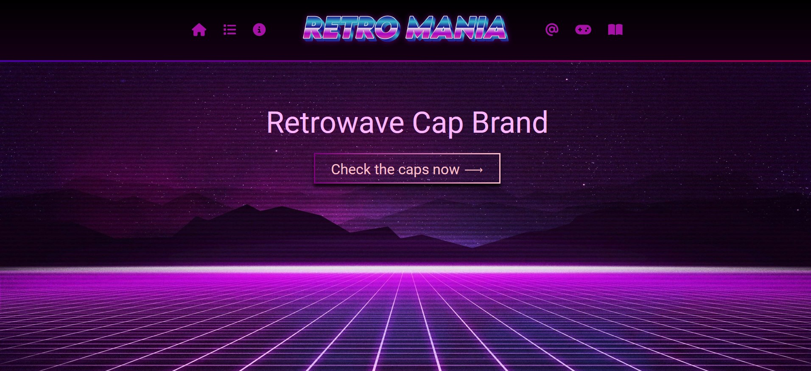

# Retro Mania 🧢

Dans le cadre de la formation de développeur web que j'ai réalisé à la 3W Academy en 2022, j'ai dû réaliser un site internet possèdant une architecture MVC en PHP. J'ai donc réalisé le site internet d'une entreprise fictive américaine, nommée. Celle-ci fabrique et commercialise des casquettes au sein de sa boutique locale à San Fransisco, autour du thème de la retrowave. Afin de faire la promotion de ses casquettes auprès du grand public, l'entreprise possèe une site vitrine.

## Liens du site

Le site internet est accessible à tout visiteur à l'adresse suivante:
 - [retro-mania.melanieroussy.fr](retro-mania.melanieroussy.fr)

L'espace administrateur est accessible à partir du lien suivant:
 - [https://retro-mania.melanieroussy.fr/index.php?p=admin_home](retro-mania.melanieroussy.fr)

## Langages

- **Front-end:** HTML, CSS, JavaScript (avec librairie d'icônes Fontawesome)
- **Back-end:** PHP, SQL

## Outils

- **IDE:** Visual Studio code
- **Serveur local:** MAMP (utilisation de MySQL et phpMyAdmin)
- **Gestion de version**: Git
- **Client FTP:** Filezilla

&nbsp;&nbsp;&nbsp;&nbsp;&nbsp;&nbsp;<a href="https://www.w3schools.com/css/" target="_blank" rel="noreferrer">&nbsp;&nbsp;</a>&nbsp;&nbsp;

## Screenshot

 

